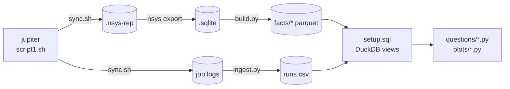

# Node-level parallelisation of Ozaki Scheme II

Accelarating a Multi-GPU implementation of Ozaki Scheme II

Optimising Multi-GPU FP64 GEMM emulation on JUPITER GH200s

<!--
TODO: confirm title, subtitle and affiliation line.
-->

---

# Motivation: hardware is going low precision

Driven by the AI boom, Nvidia's accelerators increasingly prioritise low-precision work.

- Deep learning (LLM training and inference) works well in low precision, even as low as FP4
- That is where the money is being deployed
- Nvidia is rationally incentivised to follow it

<!--
Unlike scientific computing, deep learning workloads like LLM training and inference work well in low precision, even as low as FP4.

There are currently trillions of dollars being deployed.

Nvidia, as a profit-making enterprise, is rationally incentivised to pursue this.

TODO: finish these two sentences; add a source for the spending figure.
-->

---

# Motivation

NVIDIA hardware increasingly favours low precision

<!--
Low-precision throughput has grown by orders of magnitude, while native FP64 has stagnated and even been cut (B300).

TODO: verify B200/Rubin figures and the Rubin emulated-FP64 marker before presenting.
-->

---

# Motivation: where that leaves us

Scientific simulations have long operated in the high-precision FP64 regime.

The onus falls on us to find ways to _emulate_ FP64 algorithms in lower precision.

<!--
This leaves scientific simulations, long operating in FP64, in a pickle.

TODO: finish "Nvidia will ..." and "To obtain high precision performance, ...".
-->

---

# Ozaki scheme II

An algorithm for emulating high-precision matrix multiplication using low-precision operations, using the _Chinese Remainder Theorem_.

- Split each matrix into slices small enough that their products are exact
- Multiply the slices with low-precision GEMMs
- Sum the partial products to recover the FP64 result

<!--
TODO: check these bullets against how you want to present scheme I; add a diagram of the slicing.
-->

---

# Chinese Remainder Theorem

Let $x \in \mathbb{Z}$, and let $p_1, \dots, p_N \in \mathbb{N}_{\ge 2}$ be pairwise coprime with $\mathcal{P} := \prod_{i=1}^{N} p_i$.

- Let $q_i \in \mathbb{N}$ be the modular inverse of $\mathcal{P}/p_i$, such that $\frac{\mathcal{P}}{p_i}\, q_i \equiv 1 \pmod{p_i}$
- Suppose $x$ is known only through its residues:

$$
x \equiv y_1 \pmod{p_1}, \quad \dots, \quad x \equiv y_N \pmod{p_N}
$$

- Then $x$ is recovered modulo $\mathcal{P}$:

$$
x \equiv \sum_{i=1}^{N} \frac{\mathcal{P}}{p_i}\, q_i\, y_i \pmod{\mathcal{P}}
$$

- This is a **weighted sum** of the residues: each $y_i$ gets a fixed weight $\frac{\mathcal{P}}{p_i}\, q_i$ that depends only on the moduli

<!--
N pairwise coprime moduli, each at least 2; their product is P.

TODO: why N_{>=2}? (a modulus of 1 carries no information.)

The modular inverse q_i is the number you multiply P/p_i by to get 1 mod p_i. It exists because P/p_i is coprime to p_i.

The system is N congruences with the same x on the left; each y_i is x mod p_i.

Spelled out: x = P/p_1 q_1 y_1 + P/p_2 q_2 y_2 + ... + P/p_N q_N y_N (mod P).

The weights are where the work happens: the residues change with x, the weights never do. Next slide: why these particular numbers.
-->

---

# Why the weights work

Call $e_i := \frac{\mathcal{P}}{p_i}\, q_i$ the $i$-th weight. Each factor has one job:

- $\frac{\mathcal{P}}{p_i}$ contains every **other** modulus, so $e_i \equiv 0 \pmod{p_j}$ for all $j \ne i$
- $q_i$ rescales it so that $e_i \equiv 1 \pmod{p_i}$

So $e_i$ is a **switch**: $1$ through modulus $p_i$, $0$ through all the others. Reducing $\sum_i e_i\, y_i$ mod $p_j$ kills every term but $e_j y_j \equiv y_j$.

| $p = (3, 5, 7)$, $\mathcal{P} = 105$ | $\bmod 3$ | $\bmod 5$ | $\bmod 7$ |
|---|:-:|:-:|:-:|
| $e_1 = 35 \cdot 2 = 70$ | $1$ | $0$ | $0$ |
| $e_2 = 21 \cdot 1 = 21$ | $0$ | $1$ | $0$ |
| $e_3 = 15 \cdot 1 = 15$ | $0$ | $0$ | $1$ |

$x = 52$ has residues $y = (1, 2, 3)$:

$$
70 \cdot 1 + 21 \cdot 2 + 15 \cdot 3 = 157 \equiv 52 \pmod{105}
$$

The weights depend only on the moduli, so they are precomputed once (`qPi` in par_gemmul8).

<!--
Think of the residues (y_1, ..., y_N) as coordinates of x. The weights are the unit vectors in those coordinates: e_1 looks like (1, 0, 0), e_2 like (0, 1, 0), and so on. x is then just y_1 e_1 + y_2 e_2 + ..., exactly like writing a vector in the standard basis.

Same idea as Lagrange interpolation: each basis polynomial is 1 at its own node and 0 at the others, so the sum hits every data point.

Why P/p_i: it is the product of all the moduli except p_i, so it is divisible by every p_j with j != i. That gives the zeros. It is coprime to p_i, so it has an inverse q_i mod p_i; multiplying by q_i turns its residue mod p_i into 1 without disturbing the zeros.

Example: 35 = 5 * 7 is 2 mod 3; the inverse of 2 mod 3 is 2, so e_1 = 70. 21 = 3 * 7 is already 1 mod 5, and 15 = 3 * 5 is already 1 mod 7.

The sum is only determined mod P: adding any multiple of P keeps every residue the same. That is why we reduce mod P at the end, and why x must fit in P (the next slide).
-->

---

# The CRT in action

<CrtExplorer />

<!--
Each dial is one int8 modulus from par_gemmul8; the hand is the signed residue y_i, which is what fits in int8.

Press reconstruct: the dot walks round the ring Z/P one term (P/p_i) q_i y_i at a time and always lands on x mod P.

Whether that is x itself depends on P: try int64 max with N = 8 (wraps), then N = 9 (exact).
-->

---

# Ozaki scheme II

Uses the Chinese Remainder Theorem.

- Scale $A$ and $B$ to integer matrices $A'$, $B'$
- Compute $C_i = A'B' \bmod m_i$ for pairwise-coprime moduli $m_i$
- Reconstruct $A'B'$ from the $C_i$ with the CRT, then scale back

<!--
TODO: check these bullets; say why scheme II beats scheme I (GEMM count), and how many moduli are needed for FP64.
-->

---
clicks: 5
---

# Ozaki scheme II, step by step

<OzakiSteps :step="$clicks" />

<!--
A real 4x4 by 4x3 product, run through the same accurate-mode pipeline as par_gemmul8's seq::ozaki_gemm (ported from ozaki-numpy).

1. FP64 inputs, spread over six decades.
2. Each row of A and column of B gets its own power of two, chosen as large as the bit budget allows; then truncate. This is the only place we lose accuracy.
3. Slice: residues mod each p_i, all int8.
4. N independent int8 GEMMs, this is the expensive part and what we parallelise.
5. CRT gives back A'B' exactly (see the CRT slides before).
6. Undo the powers of two. Drag N: error falls ~4 bits per modulus until FP64's own limit.
-->

---

# The platform

JUPITER

- Each node has 4x Grace Hopper 200 superchips

<!--
I'm grateful to have been able to spend this summer using JUPITER nodes, each of which has 4x Grace Hopper 200 superchips.

TODO: node diagram or photo; memory and interconnect figures if relevant.
-->

---

# par_gemull8

- Started from a functional prototype put together using AI tools
- Around 14k lines to productionise and streamline

Three paths:

- `run_par_ozaki`
- `run_par_ozaki_async`
- `run_ref_par_ozaki`

<!--
We had a functional prototype put together using AI tools, but work had to be done to productionise and streamline around 14k lines.

TODO: one line on what par_gemul8 is before the history.
-->

---

# Distributing the matrices

Each MPI rank owns one tile of every matrix.

<!--
TODO: talk through the process grid (prow/pcol) and the local tile sizes.
-->

---
clicks: 6
---

# How the tiles move

<TileExchange :step="$clicks" />

<!--
Each panel is one GPU, laid out in its place on the 2x2 grid. The mini grids show which tiles of A, B and C that GPU holds; colour is the rank the tile belongs to, ticks are the int8 residue planes it holds, one per modulus.

Clicks step through the par_ozaki stages. The toggle switches to ref_par_ozaki, which only has three stages.

ref: swap FP64 tiles with row/column peers, then two full sequential Ozaki runs per rank.
par: split the moduli, not the tiles. Expand locally, all-to-all the planes, one big GEMM per owned modulus, all-to-all the C tiles back, CRT locally.

Click a rank to isolate its traffic in the all-to-all stages.
-->

---

# Step one: profile the code

We added NVTX ranges throughout the codebase.

<!--
The first step was to profile the code. We added nvtx ranges throughout the codebase to do this.

TODO: a snippet showing an NVTX range, and a profiler timeline screenshot.
-->

---

# CUTLASS

CUTLASS is .

- Fused moduli + gemm step
- Tuned to the GPU, uses all the SMs

---

# Side quest: Cross-rank/run/version analysis pipeline with 

- `.nsys-rep` files are really just `.sqlite` files underneath
-

---

# Copy engine based collectives

- Since the CUTLASS kernels use every SM on the GPU, any other kernels using the SMs causes contention and slows things down.
- NCCL collectives need the SMs to perform reductions; but even non-reduction collectives also use them
- We opt for peer-to-peer communication to free the SMs to focus purely on the compute kernels. These only use the copy engines.
