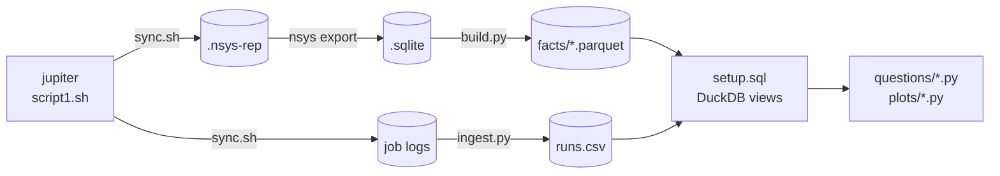

# Node-level parallelisation of Ozaki Scheme II

Accelarating a Multi-GPU implementation of Ozaki Scheme II

Optimising Multi-GPU FP64 GEMM emulation on JUPITER GH200s

<!--
TODO: confirm title, subtitle and affiliation line.
-->

---

# Motivation: hardware is going low precision

Driven by the AI boom, Nvidia's accelerators increasingly prioritise low-precision work.

- Deep learning (LLM training and inference) works well in low precision, even as low as FP4
- That is where the money is being deployed
- Nvidia is rationally incentivised to follow it

<!--
Unlike scientific computing, deep learning workloads like LLM training and inference work well in low precision, even as low as FP4.

There are currently trillions of dollars being deployed.

Nvidia, as a profit-making enterprise, is rationally incentivised to pursue this.

TODO: finish these two sentences; add a source for the spending figure.
-->

---

# Motivation

NVIDIA hardware increasingly favours low precision

<!--
Low-precision throughput has grown by orders of magnitude, while native FP64 has stagnated and even been cut (B300).

TODO: verify B200/Rubin figures and the Rubin emulated-FP64 marker before presenting.
-->

---

# Motivation: where that leaves us

Scientific simulations have long operated in the high-precision FP64 regime.

The onus falls on us to find ways to _emulate_ FP64 algorithms in lower precision.

<!--
This leaves scientific simulations, long operating in FP64, in a pickle.

TODO: finish "Nvidia will ..." and "To obtain high precision performance, ...".
-->

---

# Ozaki scheme II

An algorithm for emulating high-precision matrix multiplication using low-precision operations, using the _Chinese Remainder Theorem_.

- Split each matrix into slices small enough that their products are exact
- Multiply the slices with low-precision GEMMs
- Sum the partial products to recover the FP64 result

<!--
TODO: check these bullets against how you want to present scheme I; add a diagram of the slicing.
-->

---

# Chinese Remainder Theorem

Let $x \in \mathbb{Z}$, and let $p_1, \dots, p_N \in \mathbb{N}_{\ge 2}$ be pairwise coprime with $\mathcal{P} := \prod_{i=1}^{N} p_i$.

- Let $q_i \in \mathbb{N}$ be the modular inverse of $\mathcal{P}/p_i$, such that $\frac{\mathcal{P}}{p_i}\, q_i \equiv 1 \pmod{p_i}$
- Suppose $x$ is known only through its residues:

$$
x \equiv y_1 \pmod{p_1}, \quad \dots, \quad x \equiv y_N \pmod{p_N}
$$

- Then $x$ is recovered modulo $\mathcal{P}$:

$$
x \equiv \sum_{i=1}^{N} \frac{\mathcal{P}}{p_i}\, q_i\, y_i \pmod{\mathcal{P}}
$$

- This is a **weighted sum** of the residues: each $y_i$ gets a fixed weight $\frac{\mathcal{P}}{p_i}\, q_i$ that depends only on the moduli

<!--
N pairwise coprime moduli, each at least 2; their product is P.

TODO: why N_{>=2}? (a modulus of 1 carries no information.)

The modular inverse q_i is the number you multiply P/p_i by to get 1 mod p_i. It exists because P/p_i is coprime to p_i.

The system is N congruences with the same x on the left; each y_i is x mod p_i.

Spelled out: x = P/p_1 q_1 y_1 + P/p_2 q_2 y_2 + ... + P/p_N q_N y_N (mod P).

The weights are where the work happens: the residues change with x, the weights never do. Next slide: why these particular numbers.
-->

---

# Why the weights work

Call $e_i := \frac{\mathcal{P}}{p_i}\, q_i$ the $i$-th weight. Each factor has one job:

- $\frac{\mathcal{P}}{p_i}$ contains every **other** modulus, so $e_i \equiv 0 \pmod{p_j}$ for all $j \ne i$
- $q_i$ rescales it so that $e_i \equiv 1 \pmod{p_i}$

So $e_i$ is a **switch**: $1$ through modulus $p_i$, $0$ through all the others. Reducing $\sum_i e_i\, y_i$ mod $p_j$ kills every term but $e_j y_j \equiv y_j$.

| $p = (3, 5, 7)$, $\mathcal{P} = 105$ | $\bmod 3$ | $\bmod 5$ | $\bmod 7$ |
|---|:-:|:-:|:-:|
| $e_1 = 35 \cdot 2 = 70$ | $1$ | $0$ | $0$ |
| $e_2 = 21 \cdot 1 = 21$ | $0$ | $1$ | $0$ |
| $e_3 = 15 \cdot 1 = 15$ | $0$ | $0$ | $1$ |

$x = 52$ has residues $y = (1, 2, 3)$:

$$
70 \cdot 1 + 21 \cdot 2 + 15 \cdot 3 = 157 \equiv 52 \pmod{105}
$$

The weights depend only on the moduli, so they are precomputed once (`qPi` in par_gemmul8).

<!--
Think of the residues (y_1, ..., y_N) as coordinates of x. The weights are the unit vectors in those coordinates: e_1 looks like (1, 0, 0), e_2 like (0, 1, 0), and so on. x is then just y_1 e_1 + y_2 e_2 + ..., exactly like writing a vector in the standard basis.

Same idea as Lagrange interpolation: each basis polynomial is 1 at its own node and 0 at the others, so the sum hits every data point.

Why P/p_i: it is the product of all the moduli except p_i, so it is divisible by every p_j with j != i. That gives the zeros. It is coprime to p_i, so it has an inverse q_i mod p_i; multiplying by q_i turns its residue mod p_i into 1 without disturbing the zeros.

Example: 35 = 5 * 7 is 2 mod 3; the inverse of 2 mod 3 is 2, so e_1 = 70. 21 = 3 * 7 is already 1 mod 5, and 15 = 3 * 5 is already 1 mod 7.

The sum is only determined mod P: adding any multiple of P keeps every residue the same. That is why we reduce mod P at the end, and why x must fit in P (the next slide).
-->

---

# The CRT in action

<CrtExplorer />

<!--
Each dial is one int8 modulus from par_gemmul8; the hand is the signed residue y_i, which is what fits in int8.

Press reconstruct: the dot walks round the ring Z/P one term (P/p_i) q_i y_i at a time and always lands on x mod P.

Whether that is x itself depends on P: try int64 max with N = 8 (wraps), then N = 9 (exact).
-->

---

# Ozaki scheme II

Uses the Chinese Remainder Theorem.

- Scale $A$ and $B$ to integer matrices $A'$, $B'$
- Compute $C_i = A'B' \bmod m_i$ for pairwise-coprime moduli $m_i$
- Reconstruct $A'B'$ from the $C_i$ with the CRT, then scale back

<!--
TODO: check these bullets; say why scheme II beats scheme I (GEMM count), and how many moduli are needed for FP64.
-->

---
clicks: 5
---

# Ozaki scheme II, step by step

<OzakiSteps :step="$clicks" />

<!--
A real 4x4 by 4x3 product, run through the same accurate-mode pipeline as par_gemmul8's seq::ozaki_gemm (ported from ozaki-numpy).

1. FP64 inputs, spread over six decades.
2. Each row of A and column of B gets its own power of two, chosen as large as the bit budget allows; then truncate. This is the only place we lose accuracy.
3. Slice: residues mod each p_i, all int8.
4. N independent int8 GEMMs, this is the expensive part and what we parallelise.
5. CRT gives back A'B' exactly (see the CRT slides before).
6. Undo the powers of two. Drag N: error falls ~4 bits per modulus until FP64's own limit.
-->

---

# The platform

JUPITER

- Each node has 4x Grace Hopper 200 superchips

<!--
I'm grateful to have been able to spend this summer using JUPITER nodes, each of which has 4x Grace Hopper 200 superchips.

TODO: node diagram or photo; memory and interconnect figures if relevant.
-->

---

# par_gemull8

- Started from a functional prototype put together using AI tools
- Around 14k lines to productionise and streamline

Three paths:

- `run_par_ozaki`
- `run_par_ozaki_async`
- `run_ref_par_ozaki`

<!--
We had a functional prototype put together using AI tools, but work had to be done to productionise and streamline around 14k lines.

TODO: one line on what par_gemul8 is before the history.
-->

---

# Distributing the matrices

Each MPI rank owns one tile of every matrix.

<!--
TODO: talk through the process grid (prow/pcol) and the local tile sizes.
-->

---
clicks: 6
---

# How the tiles move

<TileExchange :step="$clicks" />

<!--
Each panel is one GPU, laid out in its place on the 2x2 grid. The mini grids show which tiles of A, B and C that GPU holds; colour is the rank the tile belongs to, ticks are the int8 residue planes it holds, one per modulus.

Clicks step through the par_ozaki stages. The toggle switches to ref_par_ozaki, which only has three stages.

ref: swap FP64 tiles with row/column peers, then two full sequential Ozaki runs per rank.
par: split the moduli, not the tiles. Expand locally, all-to-all the planes, one big GEMM per owned modulus, all-to-all the C tiles back, CRT locally.

Click a rank to isolate its traffic in the all-to-all stages.
-->

---

# Step one: profile the code

We added NVTX ranges throughout the codebase.

<!--
The first step was to profile the code. We added nvtx ranges throughout the codebase to do this.

TODO: a snippet showing an NVTX range, and a profiler timeline screenshot.
-->

---

# CUTLASS

CUTLASS is .

- Fused moduli + gemm step
- Tuned to the GPU, uses all the SMs

---

# Side quest: Cross-rank/run/version analysis pipeline with 

- `.nsys-rep` files are really just `.sqlite` files underneath
-

---

# Copy engine based collectives

The fused CUTLASS GEMM launches 132 blocks: **one per SM** on the GH200. Anything else on the SMs competes with it.

**NCCL** `SendRecv`: a kernel

- Takes 24 SMs, pushing 24 GEMM blocks into a second wave: GEMM **3.1–3.8 ms → 4.8–5.1 ms**
- Can't make progress while the GEMMs fill every SM: an exchange that takes 1.05 ms alone took **4.78 ms**, with no overlap
- Even a plain send/recv with no reduction needs SMs

**Peer copy**: CUDA IPC + `cudaMemcpy2DAsync`

- Runs on the **copy engines**, so **zero SMs** are used
- Each rank maps its peers' buffers once over MPI, then:
  - **pulls** the A/B int8 planes straight into its assembled buffer, so one strided copy replaces recv + unpack
  - **pushes** each C tile to its owner as soon as that GEMM ends
- The ordering NCCL used to provide now comes from events + two host barriers

<!--
The moduli GEMM assumes it owns the device. NCCL's communication kernels are still kernels: 24 blocks of ncclDevKernel_SendRecv take SMs away, so 24 GEMM blocks run as a second wave. Worse, a communication kernel sitting on an SM makes no progress while the rank's own GEMM saturates the device, so the exchange only finished when the GEMMs did.

Peer copies are DMA on the copy engines, which don't care how busy the SMs are. Setup: cuMemGetAddressRange for each allocation's base, cudaIpcGetMemHandle / cudaIpcOpenMemHandle brokered over MPI, done once.

Pull for A/B: the reader knows when it needs the data. Push for C: the writer knows from a local event when GEMM j is done.

NCCL's send/recv pairing also gave us cross-rank ordering for free. A pull doesn't, so there are host barriers: one so no rank reads a plane before its peer has produced it, and one so no rank overwrites a plane while a peer is still reading it.

Behind PGEMM_PEER_COPY=1. It needs 4 ranks on one node with distinct P2P-capable GPUs, and falls back to NCCL otherwise.
-->

---
clicks: 3
---

# Copy engine based collectives: the timeline

<StageTimeline :step="$clicks" />

<!--
Real nsys data: stage 3 (assemble + moduli GEMM) on rank 2, rep 0 of the round-0 job of each step, all on jpbo-103-23. Rank 2 is the slowest GPU on that node, so its stage ends on its own last GEMM rather than waiting at a barrier for someone else. Regenerate with analysis/plots/stage3_export.py.

Top band: what runs on the SMs. Bottom band: the copy engines, one lane per peer link in, one per peer out. Each click is one commit; bars slide to where they ran in that step. The dashed lines are where the other steps' stages ended.

NCCL: the copy engines sit idle. The A/B exchange for GEMM 1 is launched at 0.3 ms but can't start until GEMM 0's blocks begin retiring at ~4.7 ms (hatched). It's a kernel and every SM is taken. So GEMM 1 starts at ~6.2 ms. The C exchanges after each GEMM are NCCL kernels too.

A/B planes on the copy engines: all of both GEMMs' inputs land by ~1.4 ms, on the copy engines, with no SMs used. GEMM 1 now starts as soon as GEMM 0 lets it. But each link runs one copy at a time, A0, A1, B0, B1: B0 is ready but stuck behind A1 (hatched), and GEMM 0 needs B0, not A1.

Copies reordered: hold A(j) until B(j-1) lands, so each link runs A0, B0, A1, B1. GEMM 0 starts ~330 µs earlier, and everything behind it moves with it.

C pushed: the C exchange leaves NCCL too. Each tile is pushed straight into its owner's buffer as soon as its GEMM ends, so GEMM 0's tiles go out while GEMM 1 is still running.

Hover any bar for its times. "zoom" shows the first 1.6 ms, where the copy reordering is easier to see.
-->

---

# Copy engine based collectives: results

`par_ozaki_async`, 12000³, 8 moduli. Every step rebuilt and rerun on **one node**, interleaved. Slowest rank, mean of 2 jobs.

| Step | Total (ms) | Δ (ms) | Assemble + GEMM (ms) |
|---|--:|--:|--:|
| NCCL | 14.89 | | 11.08 |
| **A/B planes on the copy engines** | **13.59** | **−1.30** | 9.80 |
| **Copies reordered: GEMM 0's inputs first** | **13.19** | **−0.40** | 9.45 |
| **C tiles pushed peer-to-peer** | **12.83** | **−0.36** | 8.97 |

- **14.9 → 12.8 ms (−14%)**, same accuracy (max rel. error 7.3 × 10⁻¹⁵)
- Every step helps, and no job of one step overlaps a job of the next
- Under NCCL each GEMM needs **23% more cycles**: the second wave, measured
- First attempt silently ran NCCL: `srun` gave each rank one GPU, so all four saw "device 0"

<!--
Jobs 2161528–2161535, all on jpbo-103-23 (scripts/peer_copy_campaign.sh). Four builds: HEAD with PGEMM_PEER_COPY=0, c0af880^, c0af880 and HEAD with it on. Nothing under src/ or include/ differs between them except the peer-copy commits, so each step is exactly one commit. Two rounds, the order rotated between them so drift on the node doesn't line up with a step.

Why rerun: the original jobs each landed on a different node, and which GPU is slow (13–15% per GEMM) depends on the node. That was bigger than every step but the first. On mixed nodes the first step looked like −2.0 ms and the reordering looked like nothing; on one node they're −1.3 and −0.4.

"Total" is the north star: per rep, sum the NVTX stage ranges on each rank, keep the slowest rank, average over the 2 timed reps. Per job: NCCL 14.87 / 14.91, A/B 13.57 / 13.62, reordered 13.26 / 13.12, C push 12.96 / 12.70. Two jobs per step is not a significance test, but the ranges don't overlap.

The reordering: each peer link runs one copy at a time, and it ran A0, A1, B0, B1. GEMM 0 needs B0 but not A1, so B0 waited ~350 us behind A1. Holding A(j) until B(j-1) lands: GEMM 0 starts ~330 us earlier (1140 → 815 us into the stage), and GEMM 1 ~270 us earlier.

The C push: the C_mid exchange still went over NCCL and all landed after the last GEMM. Pushing each tile straight into its owner's buffer, with no packing and no NCCL kernel, lets plane 0's pushes overlap GEMM 1.

Cycles: from the nsys GPU metrics, each GEMM launch takes 4.36–4.66 M cycles under NCCL against 3.53–3.63 M with peer copy. The GPUs actually clock higher under NCCL (~1140 vs ~1000 MHz on GPU 0) because the GEMM is less tensor-dense, which partly hides it. NCCL is also noisy: its two reps differ by 1.2–1.3 ms, against 0.01–0.4 ms with peer copy.

The fallback story (job 1703699): --gpu-bind=single:1 and --gpus-per-task=1 make srun set a per-rank CUDA_VISIBLE_DEVICES, so every rank reported device ordinal 0 and the peer-copy setup refused. Fixed with --gpu-bind=none.
-->
