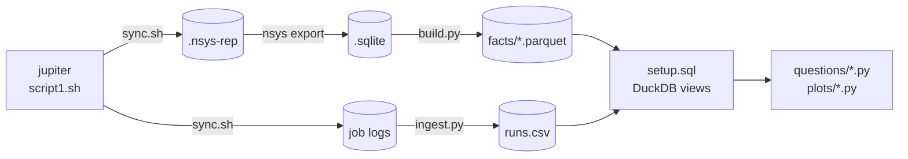

# Emulating FP64 on low-precision accelerators

Accelarating a Multi-GPU implementation of Ozaki Scheme II

Extending the parallelism in Ozaki Scheme II:

Optimising Multi-GPU Distribution of INT8 Tensor-Core GEMMs on JUPITER

  Conor McLeod · JSC Guest Student Programme

<!--
TODO: confirm title, subtitle and affiliation line.
-->

---

# Motivation: hardware is going low precision

Driven by the AI boom, Nvidia's accelerators increasingly prioritise low-precision work.

- Deep learning (LLM training and inference) works well in low precision, even as low as FP4
- That is where the money is being deployed
- Nvidia is rationally incentivised to follow it

<!--
Unlike scientific computing, deep learning workloads like LLM training and inference work well in low precision, even as low as FP4.

There are currently trillions of dollars being deployed.

Nvidia, as a profit-making enterprise, is rationally incentivised to pursue this.

TODO: finish these two sentences; add a source for the spending figure.
-->

---

# Motivation: the gap is widening

<!--
Low-precision throughput has grown by orders of magnitude, while native FP64 has stagnated and even been cut (B300).

TODO: verify B200/Rubin figures and the Rubin emulated-FP64 marker before presenting.
-->

---

# Motivation: where that leaves us

Scientific simulations have long operated in the high-precision FP64 regime.

The onus falls on us to find ways to _emulate_ FP64 algorithms in lower precision.

<!--
This leaves scientific simulations, long operating in FP64, in a pickle.

TODO: finish "Nvidia will ..." and "To obtain high precision performance, ...".
-->

---

# Ozaki scheme II

An algorithm for emulating high-precision matrix multiplication using low-precision operations, using the _Chinese Remainder Theorem_.

- Split each matrix into slices small enough that their products are exact
- Multiply the slices with low-precision GEMMs
- Sum the partial products to recover the FP64 result

<!--
TODO: check these bullets against how you want to present scheme I; add a diagram of the slicing.
-->

---

# Chinese Remainder Theorem

Let $x \in \mathbb{Z}$, and let $p_1, \dots, p_N \in \mathbb{N}_{\ge 2}$ be pairwise coprime with $\mathcal{P} := \prod_{i=1}^{N} p_i$.

- Let $q_i \in \mathbb{N}$ be the modular inverse of $\mathcal{P}/p_i$, i.e. $\frac{\mathcal{P}}{p_i}\, q_i \equiv 1 \pmod{p_i}$
- Suppose $x$ is known only through its residues:

$$
x \equiv y_1 \pmod{p_1}, \quad \dots, \quad x \equiv y_N \pmod{p_N}
$$

- Then $x$ is recovered modulo $\mathcal{P}$:

$$
x \equiv \sum_{i=1}^{N} \frac{\mathcal{P}}{p_i}\, q_i\, y_i \pmod{\mathcal{P}}
$$

<!--
N pairwise coprime moduli, each at least 2; their product is P.

TODO: why N_{>=2}? (a modulus of 1 carries no information.)

The modular inverse q_i is the number you multiply P/p_i by to get 1 mod p_i. It exists because P/p_i is coprime to p_i.

The system is N congruences with the same x on the left; each y_i is x mod p_i.

Spelled out: x = P/p_1 q_1 y_1 + P/p_2 q_2 y_2 + ... + P/p_N q_N y_N (mod P).
-->

---

# Ozaki scheme II

Uses the Chinese Remainder Theorem.

- Scale $A$ and $B$ to integer matrices $A'$, $B'$
- Compute $C_i = A'B' \bmod m_i$ for pairwise-coprime moduli $m_i$
- Reconstruct $A'B'$ from the $C_i$ with the CRT, then scale back

<!--
TODO: check these bullets; say why scheme II beats scheme I (GEMM count), and how many moduli are needed for FP64.
-->

---

# The platform

JUPITER

- Each node has 4x Grace Hopper 200 superchips

<!--
I'm grateful to have been able to spend this summer using JUPITER nodes, each of which has 4x Grace Hopper 200 superchips.

TODO: node diagram or photo; memory and interconnect figures if relevant.
-->

---

# par_gemull8

- Started from a functional prototype put together using AI tools
- Around 14k lines to productionise and streamline

Three paths:

- `run_par_ozaki`
- `run_par_ozaki_async`
- `run_ref_par_ozaki`

<!--
We had a functional prototype put together using AI tools, but work had to be done to productionise and streamline around 14k lines.

TODO: one line on what par_gemul8 is before the history.
-->

---

# Distributing the matrices

Each MPI rank owns one tile of every matrix.

<!--
TODO: talk through the process grid (prow/pcol) and the local tile sizes.
-->

---

# Step one: profile the code

We added NVTX ranges throughout the codebase.

<!--
The first step was to profile the code. We added nvtx ranges throughout the codebase to do this.

TODO: a snippet showing an NVTX range, and a profiler timeline screenshot.
-->

---

# CUTLASS

CUTLASS is .

- Fused moduli + gemm step
- Tuned to the GPU, uses all the SMs

---

# Side quest: Cross-rank/run/version analysis pipeline with 

- `.nsys-rep` files are really just `.sqlite` files underneath
-

---

# Copy engine based collectives

- Since the CUTLASS kernels use every SM on the GPU, any other kernels using the SMs causes contention and slows things down.
- NCCL collectives need the SMs to perform reductions; but even non-reduction collectives also use them
- We opt for peer-to-peer communication to free the SMs to focus purely on the compute kernels. These only use the copy engines.
