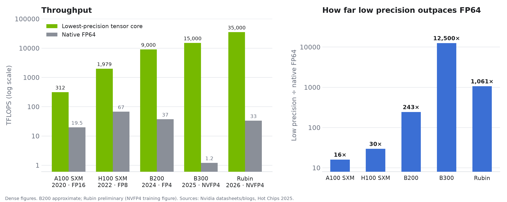
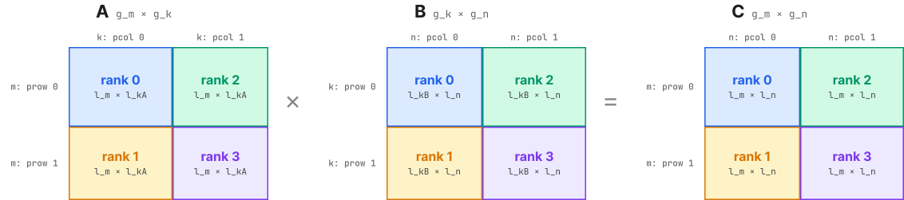
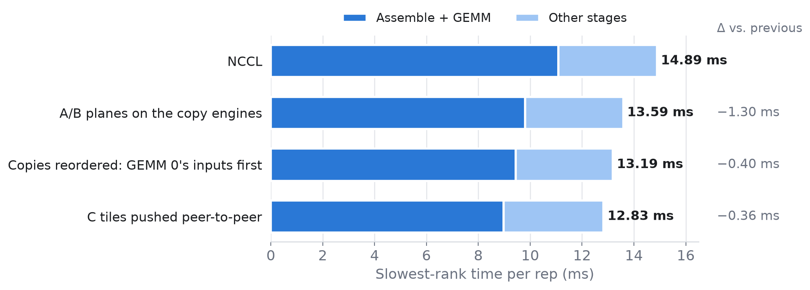
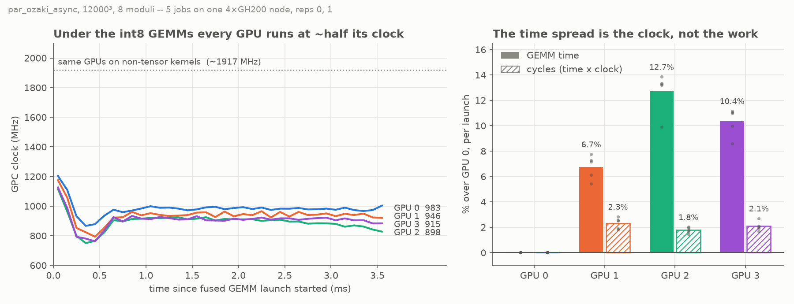
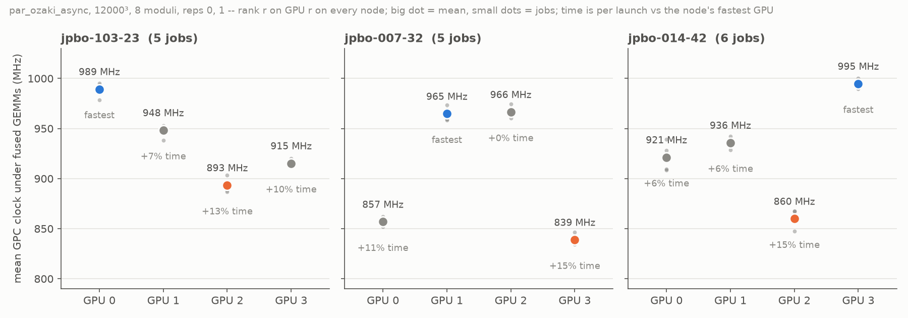

# Node-level parallelisation of Ozaki Scheme II

Accelerating a Multi-GPU implementation of Ozaki Scheme II

Optimising Multi-GPU FP64 GEMM emulation on JUPITER GH200s

---

# Motivation

Driven by the AI boom, Nvidia's newest accelerators increasingly prioritise low-precision work.



<!--
Low-precision throughput has grown by orders of magnitude, while native FP64 has stagnated and even been cut (B300).

TODO: verify B200/Rubin figures before presenting.
-->

---

# Ozaki scheme I and II

Emulate one FP64 GEMM with many **exact** int8 GEMMs. The two schemes differ in how a number becomes int8 data.

<div class="grid grid-cols-2 gap-10 mt-3">
<div>

**Scheme I: chop the bits**

<OzakiSchemes scheme="I" />

</div>
<div v-click>

**Scheme II: take residues (CRT)**

<OzakiSchemes scheme="II" />

</div>
</div>

<div v-click class="mt-4">

**Scheme II wins:** each modulus adds ~8 bits to the range $\mathcal{P} = \prod p_i$ with one GEMM, while each extra slice adds a whole row of cross products.

</div>

<!--
Scheme I (Ozaki et al., 2012): each row of A / column of B is scaled by a shared power of two, then the significands are cut into consecutive chunks of a few bits. Each chunk fits in int8, and a chunk times a chunk, summed over k, still fits in int32, so every slice GEMM is exact. A_i B_j is weighted by 2^-(7(i+j)); pairs with i + j > s + 1 fall below FP64's last bit and are dropped, hence s(s+1)/2.

Scheme II (Ozaki, Uchino, Imamura, 2025): scale once to integers, then do not cut the number at all. Its residues mod each p_i are int8, one GEMM per modulus gives A'B' mod p_i, and the CRT (next slides) rebuilds A'B' exactly.

Point to make: the left grid is the cost of I, the right row is the cost of II, drawn with the same cell size.

The N GEMMs are also independent until the CRT sum, which is what we spread over the four GPUs later.

TODO: verify the counts shown (s = 8 slices / 36 GEMMs vs N = 14 moduli) against par_gemmul8 and the papers.
-->

---

# Chinese Remainder Theorem

Let $x \in \mathbb{Z}$, and let $p_1, \dots, p_N \in \mathbb{N}_{\ge 2}$ be pairwise coprime with $\mathcal{P} := \prod_{i=1}^{N} p_i$.

- Let $q_i \in \mathbb{N}$ be the modular inverse of $\mathcal{P}/p_i$, such that $\frac{\mathcal{P}}{p_i}\, q_i \equiv 1 \pmod{p_i}$
- Suppose $x$ is known only through its residues:

$$
x \equiv y_1 \pmod{p_1}, \quad \dots, \quad x \equiv y_N \pmod{p_N}
$$

- Then $x$ is recovered modulo $\mathcal{P}$:

$$
x \equiv \sum_{i=1}^{N} \frac{\mathcal{P}}{p_i}\, q_i\, y_i \pmod{\mathcal{P}}
$$

- This is a **weighted sum** of the residues: each $y_i$ gets a fixed weight $\frac{\mathcal{P}}{p_i}\, q_i$ that depends only on the moduli

<!--
N pairwise coprime moduli, each at least 2; their product is P.

TODO: why N_{>=2}? (a modulus of 1 carries no information.)

The modular inverse q_i is the number you multiply P/p_i by to get 1 mod p_i. It exists because P/p_i is coprime to p_i.

The system is N congruences with the same x on the left; each y_i is x mod p_i.

Spelled out: x = P/p_1 q_1 y_1 + P/p_2 q_2 y_2 + ... + P/p_N q_N y_N (mod P).

The weights are where the work happens: the residues change with x, the weights never do. Next slide: why these particular numbers.
-->

---

# The CRT in action

<CrtExplorer />

<!--
Each dial is one int8 modulus from par_gemmul8; the hand is the signed residue y_i, which is what fits in int8.

Press reconstruct: the dot walks round the ring Z/P one term (P/p_i) q_i y_i at a time and always lands on x mod P.

Whether that is x itself depends on P: try int64 max with N = 8 (wraps), then N = 9 (exact).
-->

---

# Ozaki scheme II, step by step

<OzakiSteps :step="$clicks" />

<!--
A real 4x4 by 4x3 product, run through the same accurate-mode pipeline as par_gemmul8's seq::ozaki_gemm (ported from ozaki-numpy).

1. FP64 inputs, spread over six decades.
2. Each row of A and column of B gets its own power of two, chosen as large as the bit budget allows; then truncate. This is the only place we lose accuracy.
3. Slice: residues mod each p_i, all int8.
4. N independent int8 GEMMs, this is the expensive part and what we parallelise.
5. CRT gives back A'B' exactly (see the CRT slides before).
6. Undo the powers of two. Drag N: error falls ~4 bits per modulus until FP64's own limit.
-->

---

# Distributing the matrices

Each MPI rank owns one tile of every matrix.



<!--
TODO: talk through the process grid (prow/pcol) and the local tile sizes.
-->

---

# How the tiles move

<TileExchange :step="$clicks" />

<!--
Each panel is one GPU, laid out in its place on the 2x2 grid. The mini grids show which tiles of A, B and C that GPU holds; colour is the rank the tile belongs to, ticks are the int8 residue planes it holds, one per modulus.

Clicks step through the par_ozaki stages. The toggle switches to ref_par_ozaki, which only has three stages.

ref: swap FP64 tiles with row/column peers, then two full sequential Ozaki runs per rank.
par: split the moduli, not the tiles. Expand locally, all-to-all the planes, one big GEMM per owned modulus, all-to-all the C tiles back, CRT locally.

Click a rank to isolate its traffic in the all-to-all stages.
-->

---

# Copy engine based collectives

The fused CUTLASS GEMM launches 132 blocks: **one per SM** on the GH200. Anything else on the SMs competes with it.

<div class="grid grid-cols-2 gap-8 mt-4">
<div>

**NCCL** `SendRecv`: a kernel

- Takes 24 SMs, pushing 24 GEMM blocks into a second wave: GEMM **3.1–3.8 ms → 4.8–5.1 ms**
- Can't make progress while the GEMMs fill every SM: an exchange that takes 1.05 ms alone took **4.78 ms**, with no overlap
- Even a plain send/recv with no reduction needs SMs

</div>
<div>

**Peer copy**: CUDA IPC + `cudaMemcpy2DAsync`

- Runs on the **copy engines**, so **zero SMs** are used
- Each rank maps its peers' buffers once over MPI, then:
  - **pulls** the A/B int8 planes straight into its assembled buffer, so one strided copy replaces recv + unpack
  - **pushes** each C tile to its owner as soon as that GEMM ends
- The ordering NCCL used to provide now comes from events + two host barriers

</div>
</div>

<!--
The moduli GEMM assumes it owns the device. NCCL's communication kernels are still kernels: 24 blocks of ncclDevKernel_SendRecv take SMs away, so 24 GEMM blocks run as a second wave. Worse, a communication kernel sitting on an SM makes no progress while the rank's own GEMM saturates the device, so the exchange only finished when the GEMMs did.

Peer copies are DMA on the copy engines, which don't care how busy the SMs are. Setup: cuMemGetAddressRange for each allocation's base, cudaIpcGetMemHandle / cudaIpcOpenMemHandle brokered over MPI, done once.

Pull for A/B: the reader knows when it needs the data. Push for C: the writer knows from a local event when GEMM j is done.

NCCL's send/recv pairing also gave us cross-rank ordering for free. A pull doesn't, so there are host barriers: one so no rank reads a plane before its peer has produced it, and one so no rank overwrites a plane while a peer is still reading it.

Behind PGEMM_PEER_COPY=1. It needs 4 ranks on one node with distinct P2P-capable GPUs, and falls back to NCCL otherwise.
-->

---

# Copy engine based collectives: the timeline

<StageTimeline :step="$clicks" />

<!--
Real nsys data: stage 3 (assemble + moduli GEMM) on rank 2, rep 0 of the round-0 job of each step, all on jpbo-103-23. Rank 2 is the slowest GPU on that node, so its stage ends on its own last GEMM rather than waiting at a barrier for someone else. Regenerate with analysis/plots/stage3_export.py.

Top band: what runs on the SMs. Bottom band: the copy engines, one lane per peer link in, one per peer out. Each click is one commit; bars slide to where they ran in that step. The dashed lines are where the other steps' stages ended.

NCCL: the copy engines sit idle. The A/B exchange for GEMM 1 is launched at 0.3 ms but can't start until GEMM 0's blocks begin retiring at ~4.7 ms (hatched). It's a kernel and every SM is taken. So GEMM 1 starts at ~6.2 ms. The C exchanges after each GEMM are NCCL kernels too.

A/B planes on the copy engines: all of both GEMMs' inputs land by ~1.4 ms, on the copy engines, with no SMs used. GEMM 1 now starts as soon as GEMM 0 lets it. But each link runs one copy at a time, A0, A1, B0, B1: B0 is ready but stuck behind A1 (hatched), and GEMM 0 needs B0, not A1.

Copies reordered: hold A(j) until B(j-1) lands, so each link runs A0, B0, A1, B1. GEMM 0 starts ~330 µs earlier, and everything behind it moves with it.

C pushed: the C exchange leaves NCCL too. Each tile is pushed straight into its owner's buffer as soon as its GEMM ends, so GEMM 0's tiles go out while GEMM 1 is still running.

Hover any bar for its times. "zoom" shows the first 1.6 ms, where the copy reordering is easier to see.
-->

---

# Copy engine based collectives: results

`par_ozaki_async`, 12000³, 8 moduli, all steps interleaved on **one node**. Slowest rank, mean of 2 jobs.



- **14.9 → 12.8 ms (−14%)**, same accuracy (max rel. error 7.3 × 10⁻¹⁵)
- Every step helps, and no job of one step overlaps a job of the next
- Under NCCL each GEMM needs **23% more cycles**: the second wave, measured

<!--
Jobs 2161528–2161535, all on jpbo-103-23 (scripts/peer_copy_campaign.sh). Four builds: HEAD with PGEMM_PEER_COPY=0, c0af880^, c0af880 and HEAD with it on. Nothing under src/ or include/ differs between them except the peer-copy commits, so each step is exactly one commit. Two rounds, the order rotated between them so drift on the node doesn't line up with a step.

Why rerun: the original jobs each landed on a different node, and which GPU is slow (13–15% per GEMM) depends on the node. That was bigger than every step but the first. On mixed nodes the first step looked like −2.0 ms and the reordering looked like nothing; on one node they're −1.3 and −0.4.

"Total" is the north star: per rep, sum the NVTX stage ranges on each rank, keep the slowest rank, average over the 2 timed reps. Per job: NCCL 14.87 / 14.91, A/B 13.57 / 13.62, reordered 13.26 / 13.12, C push 12.96 / 12.70. Two jobs per step is not a significance test, but the ranges don't overlap.

The reordering: each peer link runs one copy at a time, and it ran A0, A1, B0, B1. GEMM 0 needs B0 but not A1, so B0 waited ~350 us behind A1. Holding A(j) until B(j-1) lands: GEMM 0 starts ~330 us earlier (1140 → 815 us into the stage), and GEMM 1 ~270 us earlier.

The C push: the C_mid exchange still went over NCCL and all landed after the last GEMM. Pushing each tile straight into its owner's buffer, with no packing and no NCCL kernel, lets plane 0's pushes overlap GEMM 1.

Cycles: from the nsys GPU metrics, each GEMM launch takes 4.36–4.66 M cycles under NCCL against 3.53–3.63 M with peer copy. The GPUs actually clock higher under NCCL (~1140 vs ~1000 MHz on GPU 0) because the GEMM is less tensor-dense, which partly hides it. NCCL is also noisy: its two reps differ by 1.2–1.3 ms, against 0.01–0.4 ms with peer copy.

The fallback story (job 1703699): --gpu-bind=single:1 and --gpus-per-task=1 make srun set a per-rank CUDA_VISIBLE_DEVICES, so every rank reported device ordinal 0 and the peer-copy setup refused. Fixed with --gpu-bind=none.
-->

---

# The GPUs halve their clock under the GEMMs

Sampled with `nsys --gpu-metrics-devices`: ~1900 MHz on other kernels, **~900–1000 MHz** once the int8 tensor cores are saturated.



<!--
Five profiled jobs on one node, par_ozaki_async, 12000 cubed, 8 moduli.

Left: the clock drops within about 250 us of a GEMM launch and stays there for the whole 3.5 ms kernel. On the same GPUs, non-tensor kernels in the same reps run at about 1900 MHz. ref_par_ozaki's GEMMs, which keep the tensor cores less busy (82% vs 92%), hold about 1300 MHz: the denser the tensor work, the lower the clock.

So peak-TOPS comparisons at the boost clock understate our efficiency by about 2x.

Right: GEMM time differs by up to 13% between ranks, but time x clock -- cycles -- by only about 2%. The slow GPUs do the same work at a lower clock.

Caveat: nsys GPU metrics have no power counter, so "power capped" is an inference -- it fits (tensor-dense work, fast onset) but is not measured. To confirm: nvidia-smi power.draw and clocks_throttle_reasons during a run.
-->

---

# The slow GPU is hardware, not the code

Rank $r$ runs on GPU $r$ on every node, yet which GPU is slow changes with the node.



- Same fastest and slowest GPU in **all 16 jobs**; repeats scatter by <15 MHz against gaps of ~100–135 MHz
- Upper bound on the cost: ~7–9% of par_ozaki_async wall time, if every GPU ran as fast as the node's best

<!--
16 jobs over three nodes, 5 or 6 each, pinned with sbatch -w. If the slowness came from the rank's share of the work, the same rank would be slow everywhere. Instead the slowest GPU is 2 on jpbo-103-23, 3 on jpbo-007-32 and 2 on jpbo-014-42, and the fastest is 0, 1 and 3.

The fastest and slowest GPU of each node are the same in every job and in all three methods, ref included -- 48 out of 48. The only order swaps are near-ties: GPUs 1 and 2 on jpbo-007-32 (965 vs 966 MHz), GPUs 0 and 1 on jpbo-014-42. Job-to-job standard deviation per GPU is 3 to 12 MHz.

The slowest GPU on a node takes 13 to 15% longer per GEMM launch. The 7-9% is an upper bound: (slowest - fastest rank GEMM time) x 2 launches per rep, over the timing-pass wall time -- 0.9 ms of 12.8 on jpbo-103-23 (7%), 1.1 of 13.1 on jpbo-014-42 (8%), 1.2 of 13.2 on jpbo-007-32 (9%). It assumes the slowest rank holds the others up at the exchange, which I have not checked.

Small leftover: rank 0 needs 1-2.5% fewer cycles per GEMM than the other ranks in all 32 par_ozaki / par_ozaki_async runs, on whichever GPU it lands. That one is a rank effect, not yet explained.

Open: chip-to-chip variation vs the slot's cooling/power delivery -- the data can't separate these. Power is still not measured.
-->

---

# Side quest: every profile in one database 

Opening `.nsys-rep` files one at a time doesn't scale to 4 ranks × 3 methods × dozens of jobs.

<div class="pipe mt-5">
  <span>jupiter<br><small>nsys, 4 ranks</small></span><i>→</i>
  <span>.nsys-rep<br><small>sync.sh</small></span><i>→</i>
  <span>.sqlite<br><small>nsys export</small></span><i>→</i>
  <span>facts/*.parquet<br><small>build.py</small></span><i>→</i>
  <span class="hl">DuckDB views<br><small>setup.sql</small></span><i>→</i>
  <span class="hl">questions/*.py<br><small>one file each</small></span>
</div>

<div class="grid grid-cols-[1fr_1.05fr] gap-6 mt-3">
<div>

- A `.nsys-rep` **is a SQLite database**: `nsys export` dumps it, and DuckDB reads it directly
- Every row carries **`job_id · method · rank · hostname`**, and every timestamp is shifted to absolute UTC, so ranks and jobs share one time axis
- Comparing across runs, ranks or methods becomes a `GROUP BY`

</div>
<div>

```sql
-- every fused GEMM launch, every job, every rank
select hostname, rank, avg(dur_us) as gemm_us
from kernels join profiles using (job_id, method, rank)
where mod_idx is not null
group by all order by gemm_us desc
```

</div>
</div>

<style>
.pipe { display: flex; align-items: center; justify-content: space-between; font-size: 0.78rem; }
.pipe span { font-family: var(--slidev-code-font-family, monospace); background: var(--fzj-gray); border-radius: 5px; padding: 3px 8px; text-align: center; line-height: 1.25; }
.pipe span.hl { background: color-mix(in srgb, var(--fzj-lightblue) 55%, white); color: var(--fzj-blue); font-weight: 700; }
.pipe small { font-family: var(--slidev-font-family, sans-serif); font-weight: 400; color: #52514e; font-size: 0.66rem; }
.pipe i { color: #8a8984; font-style: normal; }
</style>

<!--
Every profile we've taken is in one place. sync.sh pulls the reports and the job logs off jupiter with one rsync, so one TOTP prompt. nsys export turns each .nsys-rep into SQLite, and build.py projects the tables we care about (kernels, NVTX ranges, memcpys, MPI calls, GPU metrics) into parquet. 27 GB turns into 385 MB because almost all of a profile's size is OSRT_API, about 400k rows per profile, 90% of them `accept`, and nothing reads it.

The trick that makes cross-rank work possible: every nsys timestamp is relative to that process's own session start. We add TARGET_INFO_SESSION_START_TIME's UTC epoch to every one, so rank 0's kernels and rank 3's land on the same time axis. build.py also checks that the rank in the filename matches MPI_RANKS, and that every profile has the same export schema version.

The DuckDB session is disposable. Parquet + runs.csv are the durable artifacts; everything is rebuilt from them in seconds.
-->

---

# Questions that steered the project

<div class="text-sm -mt-2">Reproducible reports for rapidly evaluating specific metrics not easily accessible from NSight Systems GUI</div>

<ReportGallery class="mt-2" />

<!--
Each card is real output, trimmed to the rows that mattered.

Hotspots: on the NCCL baseline, ncclDevKernel_SendRecv was 43% of the GPU time on rank 0, competing with the fused GEMM for SMs. That's what sent us to the copy engines.

Copy order: by putting each peer copy's start and end on the same time axis as the GEMMs, we could see each link runs one copy at a time, and A(1) was going before B(0), which GEMM 0 needs.

Kernel clock: the slow rank does the same number of cycles at a lower clock.

Timing vs NVTX: the driver's own stage timers and the NVTX ranges agree, so we can trust the NVTX numbers. NVTX sees every rank, whereas the driver only prints rank 0's breakdown.
-->

---

# Also along the way

- **Profiling on JUPITER**: NVTX ranges on every pipeline stage, Nsight Systems and Nsight Compute in the batch scripts
- **Cleanup**: one set of naming conventions across the repo, duplicated code merged, dead code and old drivers removed: **−4,400 lines** net in `src/`, `include/`, `main/`
- **Correctness**: every `run_*` driver checks its result against cuBLAS
- **Tuning**: swizzled the fused GEMM's tile scheduler, ~10% faster `par_ozaki_async`
- **Fixes**: set the device before NCCL init, `sbatch` path bugs, GPU binding so every rank sees all four GPUs

<!--
The things that don't get a slide of their own.

Profiling: nvtx ranges on the sync and async paths, nsys and ncu stages in script1.sh, reports written outside $HOME. Everything else in the talk is built on these ranges.

Cleanup: written down in docs/style-guide.md (case, l_/g_ for local/global, operand letters, namespaces). par_gemm and benchmark retired in favour of the run_* drivers; ozaki::real merged into ozaki, the crt alias layer removed, three copies of moduli_range and the fused-kernel setup merged into one. 116 files changed, +9.4k / -13.8k since my first commit.

Tuning: one setting changed (CUTLASS max_swizzle_size 1 -> 8). The GPUs run the GEMM at a reduced clock to stay within power. Swizzling cuts the memory traffic, so they clock higher. Fused GEMM 13-17% faster, whole call ~10%, same accuracy. Details in par_gemmul8 docs/fused-gemm-tuning.md.

NCCL fix: ncclCommInitRank was called before cudaSetDevice and its return code wasn't checked.

Also: env_setup.sh for JUPITER, a single-GPU script for the workstation, clangd/LSP and formatting for the whole project.
-->

---

# References

- K. Ozaki, T. Ogita, S. Oishi, and S. M. Rump, ‘Error-free transformations of matrix multiplication by using fast routines of matrix multiplication and its applications’, Numer Algor, vol. 59, no. 1, pp. 95–118, Jan. 2012, doi: 10.1007/s11075-011-9478-1.

- Y. Uchino et al., ‘High-Performance and Power-Efficient Emulation of Matrix Multiplication using INT8 Matrix Engines’, in Proceedings of the SC ’25 Workshops of the International Conference for High Performance Computing, Networking, Storage and Analysis, in ACM Conferences. , 2025, pp. 1824–1831. doi: 10.1145/3731599.3767539.

---
layout: center
class: text-center
---

# Thank you!

Questions?
